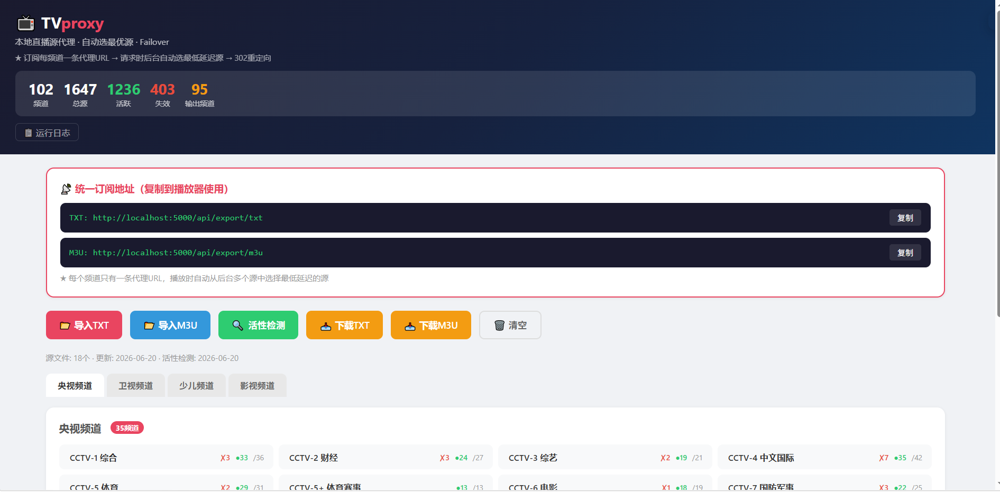
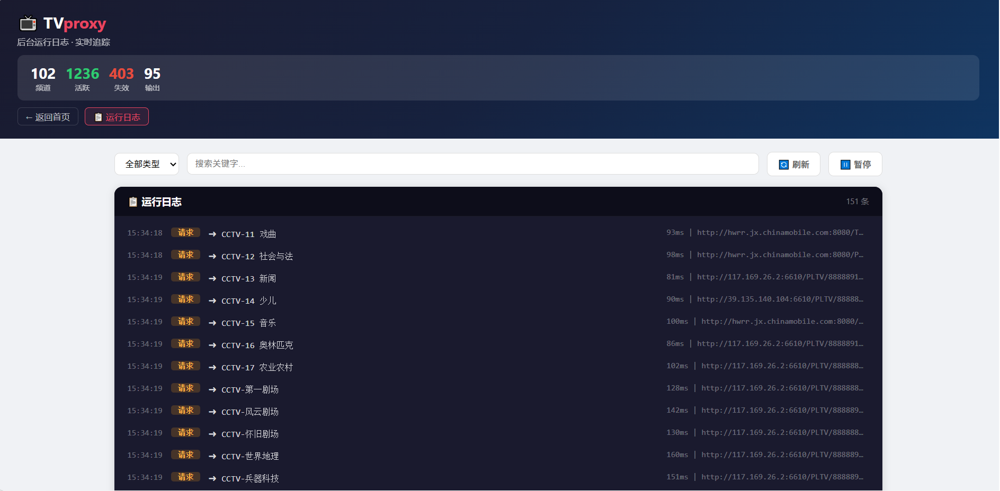

# TVproxy - 电视直播源代理服务器

本地运行的一个直播源代理服务。导入你的 TXT/M3U 源文件 → 自动匹配同一频道 → 归类排序 → 输出统一订阅，请求频道时后台自动选最低延迟的源。

**两种代理模式：**
- 🔗 **302 重定向模式**（默认）— 请求频道时 302 跳转到最优源 URL，零服务器带宽消耗
- 🔒 **全流量代理模式** — 服务器中转流数据，**不暴露原始源 URL**，适合不想透露源地址的场景

---

## 已实现功能

### 1. 多源导入 & 自动匹配

| 功能 | 说明 |
|------|------|
| **TXT 导入** | 解析 `频道名,URL` 格式，支持 `#genre#` 分类标题 |
| **M3U 导入** | 解析标准 M3U8 格式（`#EXTINF` + URL） |
| **多源合并** | 多个文件导入后自动合并同一频道 |
| **频道名标准化** | 统一命名：`CCTV1`→`CCTV-1 综合`，`CCTV16奥运`→`CCTV-16 奥林匹克`，`北京卫视HD`→`北京卫视` 等 |
| **URL 去重** | 同一 URL 不会重复收录 |

**支持的频道匹配规则：**
- 央视 1-17 频道（含 4K、5+、欧洲/美洲 等子频道）
- 央视付费频道（第一剧场、风云剧场、怀旧剧场、世界地理 等）
- CETV 1-4 / CNC 中文/英文 / CGTN 多语种
- 全国 41 个省级卫视频道
- 少儿频道（金鹰卡通、卡酷少儿、嘉佳卡通 等）
- 影视频道（CHC、超级电影/电视剧、各类剧场 等）
- 凤凰卫视（中文/资讯/香港）
- 本地频道自动排除（江西都市、南昌、九江、咪咕 等）

### 2. 归类 & 排序

| 分类 | 说明 |
|------|------|
| 央视频道 | CCTV 1-17 + 付费频道 + CETV + CNC（按数字顺序排列） |
| 卫视频道 | 全国 41 个卫视（按名称排序） |
| 少儿频道 | 金鹰卡通、卡酷少儿 等 |
| 影视频道 | CHC 系列、剧场系列、电影/电视剧 等 |

> ⚠️ 导入时只保留以上 4 类频道，其他频道（CGTN、凤凰卫视 等）在导入阶段直接丢弃。

> 💡 订阅 URL 自动使用你的访问地址（`request.host_url`），无论通过 `localhost`、内网 IP 还是域名访问，导出的代理 URL 都正确可用。

### 3. 活性检测 & 延迟测量

- 点击 Web 界面「活性检测」按钮开始
- 异步并发检测（默认 30 并发）
- 记录每个 URL 的延迟（毫秒）
- 检测完成后自动缓存最优结果
- 已失效的源不会出现在订阅中

### 4. ★ 核心功能：智能代理

这是 TVproxy 最核心的功能：

```
播放器请求
  │
  ▼
TVproxy 收到 /proxy/CCTV-1 综合
  │
  ├─ 查缓存（5分钟内有效）
  │   └─ 有缓存 → 直接返回缓存的URL
  │
  ├─ 无缓存 → 查该频道的所有可用源
  │   ├─ 源A（延迟 120ms）
  │   ├─ 源B（延迟  45ms）← 选这个！
  │   └─ 源C（延迟 300ms）
  │
  ├─ 缓存最优源（5分钟）
  │
  └─ 302 重定向到源B
        │
        ▼
     播放器直接播放源B
```

**关键特性：**
- 每频道只一条代理 URL 在订阅中
- 后台自动选最优源（最低延迟）
- 支持 failover：如果最优源失效，下次请求自动换下一个
- 5 分钟缓存避免重复检测
- 纯 302 重定向，不消耗服务器带宽

#### 代理模式切换：302 重定向 → 全流量代理

> 面板上新增了一个「🔒 代理模式」开关，可以在两种模式间自由切换：

| 模式 | 行为 | 优点 | 缺点 |
|------|------|------|------|
| **302 重定向**（默认） | 返回 302，播放器直接连源 | 零服务器带宽，性能最好 | 播放器能看到源地址 |
| **全流量代理** | 服务器中转所有流数据 | 不暴露源 URL，源完全隐藏 | 消耗服务器带宽 |

**全流量代理工作原理：**

```
播放器请求 /relay/CCTV-1 综合
  │
  ▼
TVproxy 收到请求
  │
  ├─ 查最优源（同 302 模式一致的选源逻辑）
  │
  ├─ 服务器发起 HTTP 请求到源，stream=True
  │
  └─ 以 chunked 编码边收边转发给播放器
        │
        ▼
     播放器收到流数据，不知道源地址
```

**支持的内容类型：**
- ✅ 普通直播流（MPEG-TS / FLV）— 直接 byte 流转发
- ✅ HLS（.m3u8）— 自动重写 playlist 中的 `.ts` URL 为代理路径
- ✅ 多码率 HLS（variant playlist）— 递归重写

**订阅输出：** 切换模式后，订阅 URL 也会自动变：`/proxy/CCTV-1` ↔ `/relay/CCTV-1`。面板上点击「复制订阅地址」即可获取当前模式下的正确地址。

### 5. 统一订阅输出

| 格式 | 地址 | 说明 |
|------|------|------|
| **TXT** | `http://<你的IP>:5000/api/export/txt` | 标准 txt 源格式，每频道一条 `频道名,http://<IP>:5000/proxy/频道名` |
| **M3U** | `http://<你的IP>:5000/api/export/m3u` | 标准 M3U 格式，含 tvg-id/tvg-name/tvg-logo |

> 支持 PotPlayer、VLC、Kodi、IPTV 等任意播放器直接打开链接。

### 6. Web 管理界面

| 路由 | 功能 |
|------|------|
| `/` | 仪表盘，查看所有频道状态 |
| `/logs` | **运行日志**（实时追踪导入、检测、代理请求） |
| `/api/import/txt` | 上传 TXT 文件（POST） |
| `/api/import/m3u` | 上传 M3U 文件（POST） |
| `/api/health/check` | 启动活性检测（POST） |
| `/api/health/status` | 检测进度查询（GET） |
| `/api/channels` | 频道列表 JSON |
| `/api/logs` | 运行日志 JSON 接口 |
| `/api/sources` | 已导入源文件列表 |
| `/api/reset` | 清空所有数据（POST） |

日志页面支持按类型过滤（导入/检测/代理/系统）、关键字搜索、3 秒自动刷新，每条代理请求会显示所选的具体源 URL 和延迟。|

## 界面预览

| 仪表盘 | 日志页面 |
|--------|---------|
|  |  |

---

## 项目结构

```
TVproxy/
├── app.py                         # Flask 主服务
├── requirements.txt               # Python 依赖
├── README.md                      # 本文件
├── preload.py                     # 预加载脚本
├── proxy/
│   └── relay.py                    # 全流量代理模块（HLS 重写 + byte 流转发）
├── channel_manager/
│   ├── __init__.py
│   ├── normalizer.py              # 频道名标准化
│   ├── matcher.py                 # 频道匹配引擎
│   ├── categorizer.py             # 频道归类
│   ├── sorter.py                  # 排序逻辑
│   └── health.py                  # 活性检测 + 延迟测量
├── importer/
│   ├── __init__.py
│   ├── txt_import.py              # TXT 导入
│   └── m3u_import.py              # M3U 导入
├── exporter/
│   ├── __init__.py
│   ├── txt_export.py              # TXT 订阅导出
│   └── m3u_export.py              # M3U 订阅导出
├── Dockerfile                     # Docker 多架构镜像
├── docker-compose.yml             # Docker Compose 一键启动
├── .dockerignore
├── .github/workflows/
│   └── docker.yml                 # Actions: 自动编译 amd64+arm64 → GHCR
├── templates/
│   ├── index.html                 # 仪表盘界面
│   └── logs.html                  # 运行日志页面
├── static/
└── data/
    ├── sources/                   # 上传的源文件
    ├── output/                    # 导出的订阅文件
    └── db/
        └── channels.json          # 持久化数据
```

---

## 快速开始

### 方式一：Docker（推荐）

```bash
# 拉取镜像（首次）
docker pull ghcr.io/yufanpin/tvproxy:latest

# 启动（推荐：named volume，免去路径问题）
docker run -d -p 5000:5000 --restart unless-stopped \
  -v tvproxy-data:/app/data \
  -v /etc/localtime:/etc/localtime:ro \
  --name tvproxy ghcr.io/yufanpin/tvproxy:latest

# 或者用绝对路径挂载宿主机目录
# docker run -d -p 5000:5000 --restart unless-stopped \
#   -v /root/tvproxy-data:/app/data --name tvproxy ghcr.io/yufanpin/tvproxy:latest

# 或使用 docker compose
docker compose up -d
```

> ⚠️ **注意：** `-v ./data:/app/data` 这种相对路径在 Linux 上会报错
> `invalid characters for a local volume name`，因为 Docker 把 `./data` 解析成了 volume name 而非路径。**请使用 named volume**（如上 `tvproxy-data`）或**绝对路径**。

更新镜像：
```bash
docker pull ghcr.io/yufanpin/tvproxy:latest
docker stop tvproxy && docker rm tvproxy
# 重新执行上面的 docker run 命令
```

> 支持 x86_64 和 arm64（路由器/NAS/树莓派通用）。GitHub Actions 自动编译推送到 GHCR。
> 容器设置了 `--restart unless-stopped` / `restart: unless-stopped`，宿主机重启后自动拉起。

### 方式二：本地 Python

```bash
# 1. 安装依赖
pip install flask aiohttp

# 2. 进入 TVproxy 目录
cd TVproxy

# 3. （可选）预加载已有源文件
python preload.py

# 4. 启动服务
python app.py

# 5. 浏览器打开
#    http://localhost:5000
```

### 订阅地址（在播放器中添加）

订阅 URL 自动使用你的访问地址，无需手动修改：

```
TXT: http://<路由器IP>:5000/api/export/txt
M3U: http://<路由器IP>:5000/api/export/m3u
```

示例（路由器 IP 为 192.168.10.1）：
```
TXT: http://192.168.10.1:5000/api/export/txt
M3U: http://192.168.10.1:5000/api/export/m3u
```

---

## 依赖

- Python 3.8+
- flask>=3.0
- aiohttp>=3.9

---

## 更新日志

### 2026-06-21
- ✨ **新增**: 全流量代理模式（`proxy/relay.py`，面板一键切换 302 ↔ 中继），HLS 自动重写，不暴露源 URL
- 🔧 更新内容：
  - `proxy/relay.py` — 流媒体中继模块，支持 MPEG-TS / FLV / HLS 代理
  - `app.py` — `relay_mode` 状态持久化、`/relay/<channel>` 路由、切换 API
  - `exporter/*.py` — 订阅输出根据 relay_mode 自动切换 `/proxy/` ↔ `/relay/`
  - `templates/index.html` — 中继模式开关按钮
- 🐛 **修复**: 日志时间显示 UTC 问题（Docker 容器默认时区 UTC，导致日志面板时间比本地慢 8 小时）
  - `docker-compose.yml` — 挂载 `/etc/localtime`，容器自动继承宿主机时区
  - `app.py` — `datetime.now()` → `datetime.now().astimezone()`，日志格式增加月-日
  - `templates/logs.html` — 时间列宽适配新格式

### 2026-06-20
- 🐛 **修复**: 面板全显示绿色（`alive = urls|length` 永远=总数，未查健康检测结果）
- 🐛 **修复**: `CCTV-少儿` 被丢弃（数字位数正则不匹配中文"少儿"）
- 🐛 **修复**: `CHC电影` 被丢弃（MOVIE_STANDARD 无 `CHC电影`，fallback 误杀）
- 🐛 **修复**: 复制按钮在 HTTP 下无法复制到剪贴板（改用 `execCommand` + textarea 方案）
- ✨ **新增**: 定时自动活性检测（APScheduler，默认每天 06:00，面板可开关）

### 2026-06-18
- 🔧 修正：订阅/代理 URL 改为动态获取 `request.host_url`，不再硬编码 `localhost:5000`
- 📦 Docker 镜像支持（x86_64 + arm64），自动构建推送到 GHCR

### 2026-06-09
- 🚀 初始版本：频道导入、归类（央视/卫视/少儿/影视）、健康检测、代理转发、订阅导出

- [x] ~~IPTV 回源代理（全流量代理，不暴露原始 URL）~~（✅ 面板一键切换 302 ↔ 中继）
- [x] ~~Docker 镜像支持~~（✅ 已支持 x86 + arm64，自动推送到 GHCR）
- [x] ~~定时自动活性检测~~（✅ APScheduler，每日可配置时间，面板一键开关）
- [ ] 频道收藏/自定义排序
- [ ] 多端口监听（HTTP/HTTPS）
- [ ] EPG 节目指南支持

---

## 许可证

本项目采用 **非商业使用许可**，详情请参阅 [LICENSE](./LICENSE) 文件。

- ❌ **禁止商业用途** — 不得用于任何商业目的或盈利活动
- 📝 **引用请注明出处** — 使用或引用本代码时，必须保留原作者信息及原始仓库链接
- ⚖️ **无担保** — 本软件按"原样"提供，不附带任何担保
